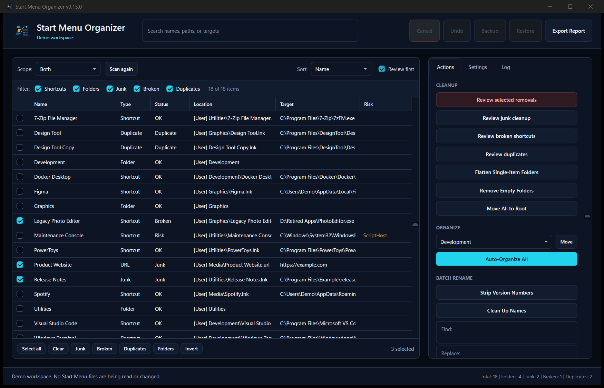
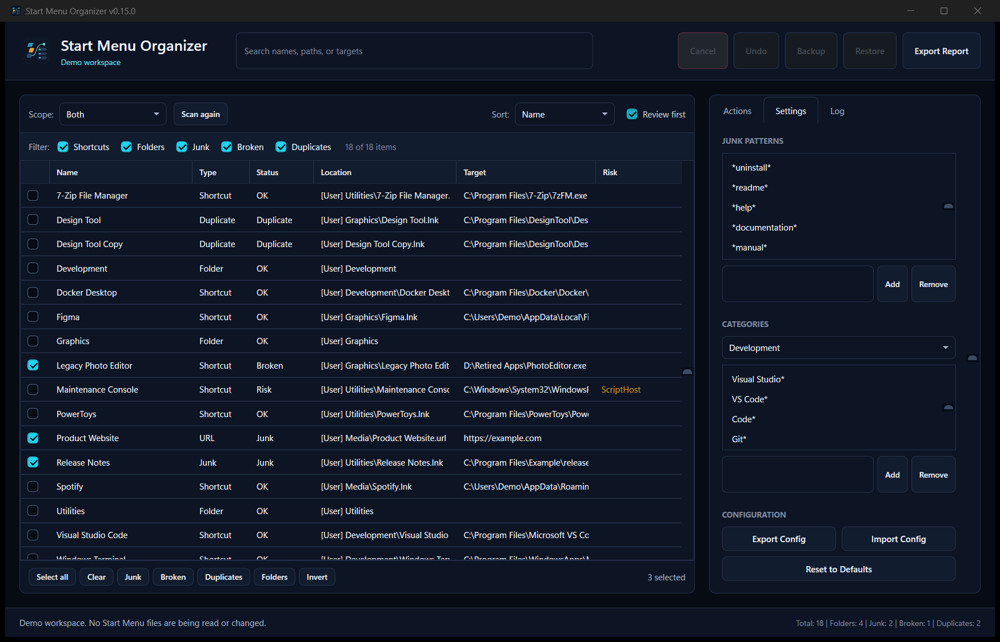
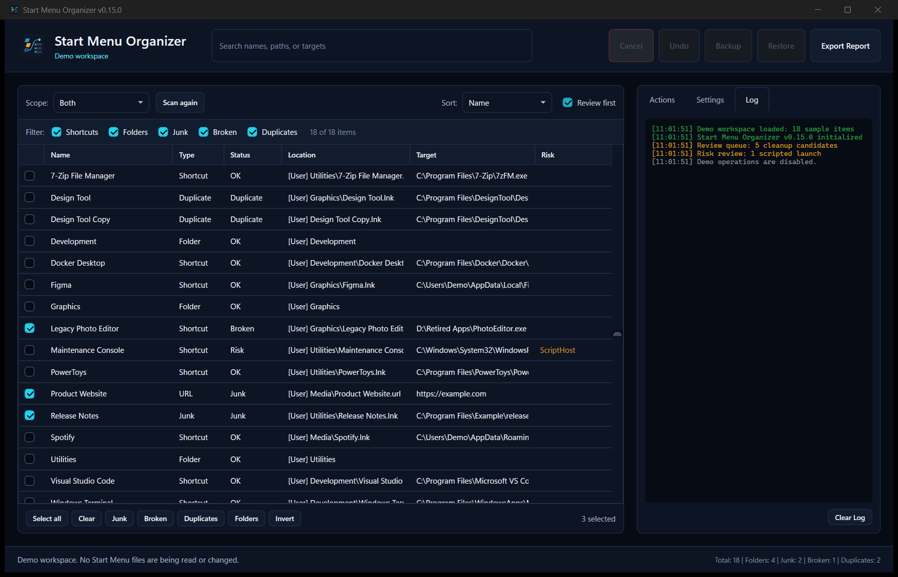

<p align="center">
  
</p>

<h1 align="center">Start Menu Organizer</h1>

<p align="center">
  Find broken shortcuts and clutter, review every proposed change, then put your Windows Start Menu back in order.
</p>

<p align="center">
  
  
  
  
</p>



Start Menu folders get noisy over time. Uninstall links remain behind, old shortcuts stop working, and the same app can appear in several places. Start Menu Organizer scans the actual shortcut folders and turns that mess into a list you can search, filter, and fix.

Every cleanup action creates a reviewable plan first. Nothing runs until you choose **Run reviewed plan**. Deletes, moves, renames, and restores also write recovery data so a mistake does not become a scavenger hunt.

## Why use it

| | What it does |
|---|---|
| **See the real problem** | Finds junk entries, broken targets, duplicates, protected folders, and shortcuts with risky launch behavior. |
| **Review before changing files** | Converts bulk actions into an exact operation plan that can be inspected, exported, or cleared. |
| **Organize in batches** | Moves apps into built-in categories, flattens small folders, cleans names, or keeps a simple root layout. |
| **Recover with confidence** | Keeps an undo journal, timestamped backups, and rollback snapshots for restores. |

## Product tour

<table>
  <tr>
    <td width="50%"></td>
    <td width="50%"></td>
  </tr>
  <tr>
    <td align="center"><b>Rules that fit your machine</b><br>Adjust junk patterns and category matching without editing the script.</td>
    <td align="center"><b>A record of what happened</b><br>Follow scans and operations in the app, with JSONL logs saved locally.</td>
  </tr>
</table>

## Install

1. Download **StartMenuOrganizer-v0.15.0.zip** from the [latest release](https://github.com/SysAdminDoc/Start-Menu-Organizer/releases/latest).
2. Extract the archive.
3. Run the installer from that folder:

```powershell
powershell -NoProfile -ExecutionPolicy Bypass -File .\Install-StartMenuOrganizer.ps1
```

The installer places the app under `%LOCALAPPDATA%\Programs\Start Menu Organizer` and adds a Start Menu shortcut. It does not need administrator access.

To remove it later:

```powershell
powershell -NoProfile -ExecutionPolicy Bypass -File "$env:LOCALAPPDATA\Programs\Start Menu Organizer\Uninstall-StartMenuOrganizer.ps1"
```

### Run without installing

Download the repository and launch the script directly:

```powershell
powershell -NoProfile -ExecutionPolicy Bypass -File .\StartMenuOrganizerPro.ps1
```

Windows 10 or Windows 11 with Windows PowerShell 5.1 is enough. There are no extra modules to install.

## A safe first cleanup

1. Choose **User Start Menu** if you only want to change your own shortcuts.
2. Select **Backup**.
3. Filter to **Junk**, **Broken**, or **Duplicates**.
4. Select the entries you recognize and prepare a cleanup plan.
5. Read the plan summary, then choose **Run reviewed plan**.

Use **Run as admin** only when you need the shared System Start Menu, another local profile, or the Default User profile. Readable locations can still be scanned with standard access, but protected changes stay blocked.

## What it detects

- Invalid `.lnk`, `.url`, and `.appref-ms` targets
- Duplicate shortcuts that point to the same application
- Common clutter such as release notes, support links, and uninstall entries
- Script hosts, network targets, hidden launches, encoded commands, and unusually long arguments
- Reparse points that should not be followed during a scan or file operation
- Installation sources including Chocolatey, Scoop, MSIX, WinGet, and traditional installers

The item table shows the target, location, status, and risk flags together. Search works across names, paths, and targets.

## Cleanup and organization

The Actions tab can prepare plans to remove flagged entries, keep one copy of each duplicate, flatten single-item folders, clear empty folders, or move shortcuts to the Start Menu root. Category tools recognize development apps, browsers, communication tools, media apps, graphics software, office tools, utilities, games, system tools, security products, and networking software.

Batch rename can remove version numbers, clean common vendor and architecture text, or apply a custom find and replace rule.

## Backups, undo, and restore

The app does not permanently erase a selected shortcut during a normal cleanup. It moves recoverable items into an operation backup area and records the original path in the undo journal.

Restore is protected separately. A backup is copied into a staging area and checked before the live Start Menu is replaced. The current contents are saved as a rollback snapshot first. If restoration fails, the app attempts to put the previous contents back automatically.

| Data | Location |
|---|---|
| Backups | `%LOCALAPPDATA%\StartMenuOrganizerPro\Backups` |
| Restore snapshots | `%LOCALAPPDATA%\StartMenuOrganizerPro\Backups\_restore_rollback` |
| Undo journal | `%LOCALAPPDATA%\StartMenuOrganizerPro\undo.json` |
| Settings | `%LOCALAPPDATA%\StartMenuOrganizerPro\config.json` |
| Logs and crash reports | `%LOCALAPPDATA%\StartMenuOrganizerPro\Logs` |

## Work with other profiles

Open **Settings**, choose a profile root such as `C:\Users\Alice` or an offline profile on another drive, then select **Selected Profile** from the scope list. **Default User** targets `%SystemDrive%\Users\Default` for preparing new Windows accounts.

Changes to either target require administrator access. Backups keep separate folders for each scope.

## Try the interface with sample data

Demo mode loads a realistic, read-only set of shortcuts. It does not scan or change this PC.

```powershell
powershell -NoProfile -ExecutionPolicy Bypass -File .\StartMenuOrganizerPro.ps1 -Demo
```

Use `-DemoView Settings` or `-DemoView Log` to open another part of the tour.

## Verify a release

Each release includes a `.sha256` file for the zip and `SHA256SUMS.txt` inside it. Compare the published value with:

```powershell
certutil -hashfile .\StartMenuOrganizer-v0.15.0.zip SHA256
```

The release scripts are not Authenticode-signed unless the release notes say otherwise. Review the source before running it if your environment requires signed PowerShell code.

## Build and test

Run the full local gate:

```powershell
powershell -NoProfile -ExecutionPolicy Bypass -File .\tests\Run-Tests.ps1
```

Build the installable archive and package metadata:

```powershell
powershell -NoProfile -ExecutionPolicy Bypass -File .\tools\Build-Release.ps1
```

The build produces Scoop and Chocolatey metadata beside the zip. It also signs the packaged scripts when a code-signing certificate is available in the current user certificate store.

## Contributing

Bug reports and focused pull requests are welcome. Include the Windows version, selected scope, and the relevant log excerpt when reporting a failed scan or file operation.

## License

Start Menu Organizer is available under the [MIT License](LICENSE).

For exporting and deploying a finished Start layout across several PCs, see [Start Menu Manager](https://github.com/SysAdminDoc/Start-Menu-Manager).
